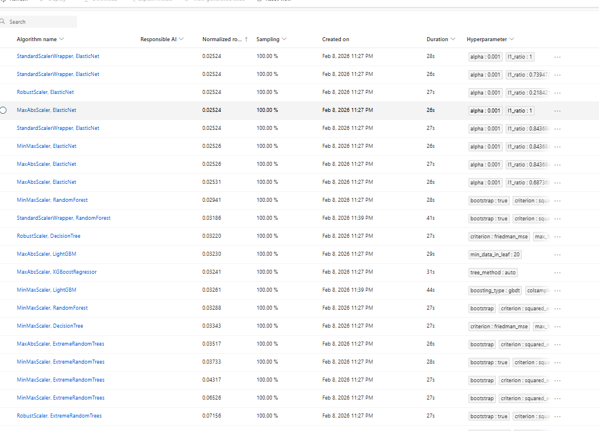
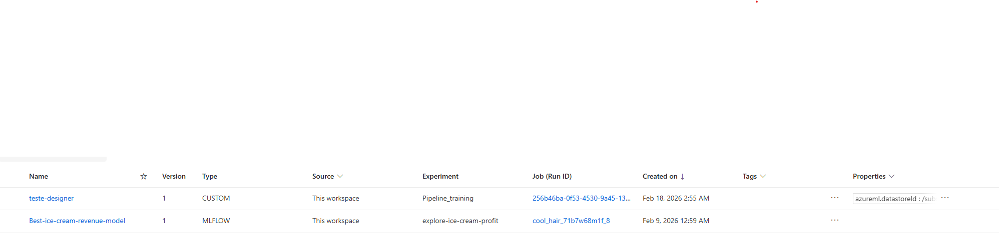

# lab-azure-ml-studio
Nesse lab foram explorados as ferramentas de auto-ML e designer para treinar modelos de predição utilizando dados de valor de vendas de sorvete no dia e a temperatura. Dados retirados da plataforma kaggle.

## Desenvolvimento
Foi criado um ambiente de ML sutdio na azure e os dados de treino foram registrados como tabela nele. Dessa forma já se tem a base para nossos testes, o processo todo foi rápido e as configurações padrões do ambiente são funcionais, o que permite rápido desenvolvimento a baixo custo, acelerando a construção de POC e testes.

A primeira ferramente explorada foi o auto-ML. Essa ferramenta testa varios modelos e hyperparametros, para dados mais simples, muitos modelos podem ser testados e otimizados, entregando um modelo publicavel em poucos minutos. Abaixo vemos todos testes feitos e o score de cada um. Como os dados são muito lineares, o melhor modelo foi o elasticNet, que é uma forma mais completa de regressão linear com regularização L1 e L2.

Depois foi treinado um mdoelo com o Designer, essa é uma ferramenta visual de blocos q permite repoduzir as etapas para treinar um modelo, separando dados, escolhendo modelo, treinando e validando. Porém esse formato low code permite testes rápidos sem a necessidade de pensar na estrutura compelta do código.

Por fim ambos modelos foram registrados como modelos prontos para serem utilizados em pipelines, serviços e api's de produção.

